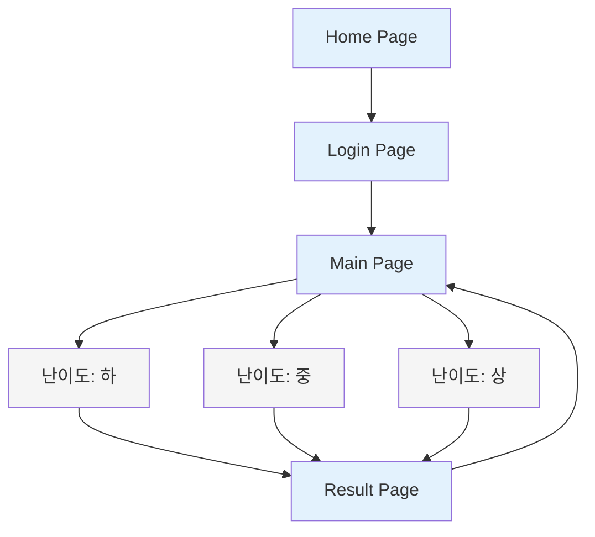
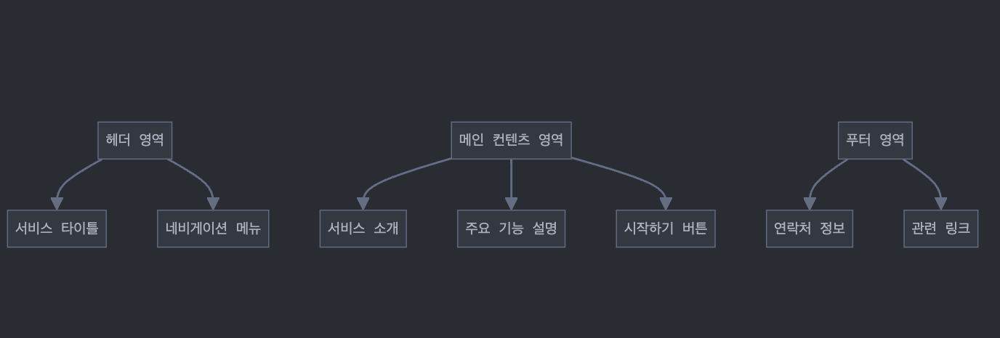
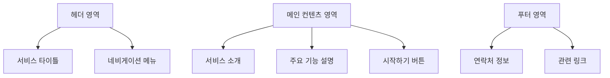
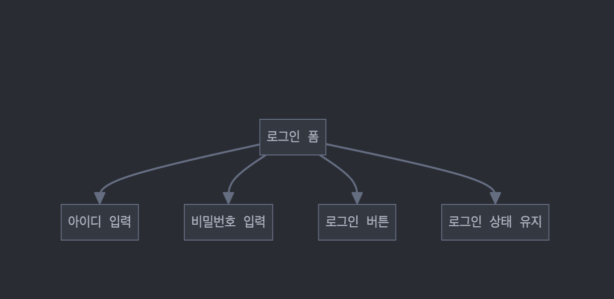
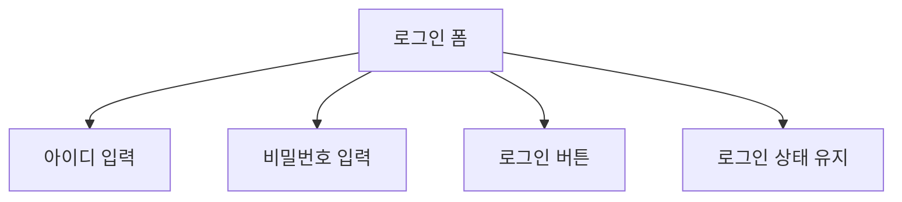
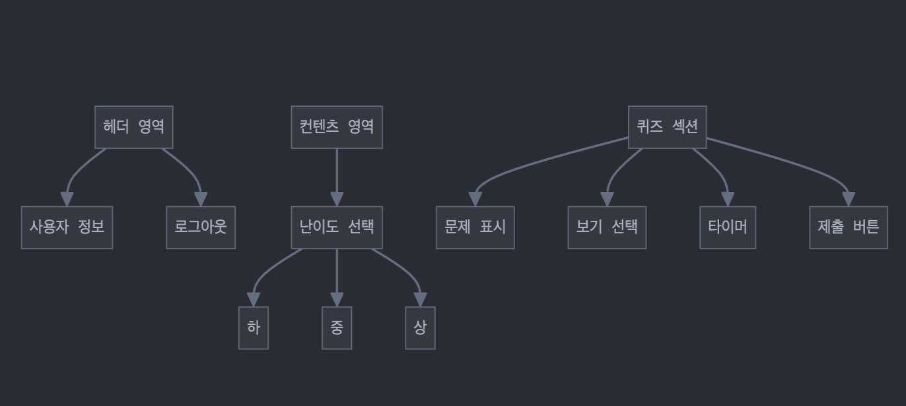
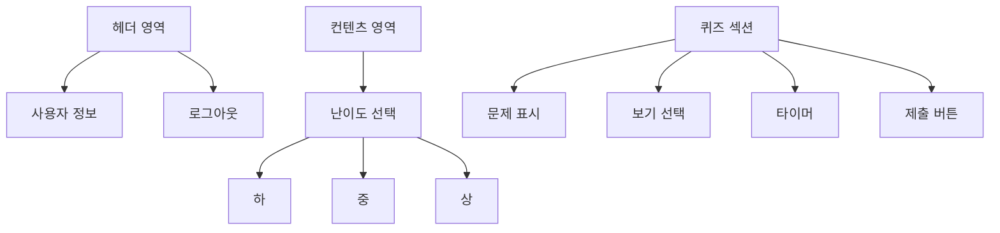
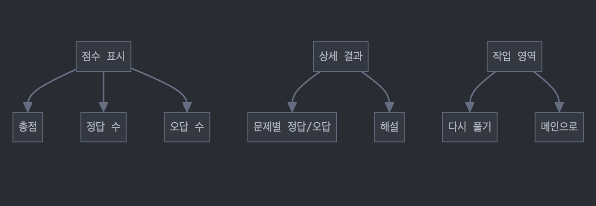
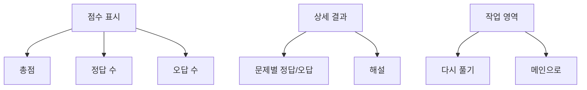

# CodeQuiz 화면 설계서

## Table of Contents
1. [전체 화면 구조도](#1-전체-화면-구조도)
2. [페이지별 상세 설계](#2-페이지별-상세-설계)
3. [페이지별 주요 기능](#3-페이지별-주요-기능)
4. [디자인 가이드라인](#4-디자인-가이드라인)

## 1. 전체 화면 구조도

## 2. 페이지별 상세 설계

### 2.1 Home Page

### 2.2 Login Page

### 2.3 Main Page

### 2.4 Result Page

## 3. 페이지별 주요 기능

### 3.1 Home Page
| 기능 | 설명 |
|------|------|
| 서비스 소개 | • Python 학습 퀴즈 플랫폼 소개 • 주요 기능 및 특징 설명 |
| 시작하기 버튼 | • 로그인 페이지로 이동 • 호버 효과 적용 |
| 반응형 레이아웃 | • 디바이스 크기에 따른 최적화 • 모바일 친화적 디자인 |

### 3.2 Login Page
| 기능 | 설명 |
|------|------|
| 사용자 인증 | • ID/PW 입력 필드 • 유효성 검사 • 에러 메시지 표시 |
| 로그인 상태 유지 | • 체크박스 기능 • 세션 관리 |
| 보안 기능 | • 비밀번호 암호화 • 보안 프로토콜 적용 |

### 3.3 Main Page
| 기능 | 설명 |
|------|------|
| 난이도 선택 | • 상/중/하 난이도 옵션 • 각 난이도별 설명 제공 |
| 퀴즈 인터페이스 | • 문제 텍스트 표시 • 4지선다 보기 • 제출 버튼 |
| 타이머 | • 문제별 제한시간 표시 • 자동 제출 기능 |
| 진행 상황 | • 현재 문제 번호 • 남은 문제 수 표시 |

### 3.4 Result Page
| 기능 | 설명 |
|------|------|
| 점수 집계 | • 총점 계산 • 정답률 표시 • 난이도별 성취도 |
| 문제 리뷰 | • 문제별 정답/오답 표시 • 해설 제공 • 오답 노트 기능 |
| 네비게이션 | • 다시 풀기 옵션 • 메인으로 돌아가기 • 다른 난이도 선택 |

## 4. 디자인 가이드라인

### 4.1 색상 규정
| 요소 | 색상 코드 | 용도 |
|------|-----------|------|
| 주요 색상 | #1976D2 | 헤더, 버튼 |
| 보조 색상 | #E3F2FD | 배경, 강조 |
| 강조 색상 | #FF5722 | 경고, 중요 표시 |
| 배경 색상 | #FFFFFF | 기본 배경 |

### 4.2 타이포그래피
| 요소 | 폰트 | 크기 | 스타일 |
|------|------|------|--------|
| 제목 | Roboto | 24px | Bold |
| 본문 | Noto Sans KR | 16px | Regular |
| 버튼 | Roboto | 18px | Medium |

### 4.3 공통 UI 요소
| 요소 | 스타일 가이드 |
|------|--------------|
| 버튼 | • border-radius: 8px • padding: 12px 24px • hover 효과 적용 |
| 입력 필드 | • border: 1px solid #CCCCCC • padding: 8px 16px • focus 효과 적용 |
| 여백 | • 기본 마진: 16px • 섹션 간격: 32px • 컨테이너 패딩: 24px |

### 4.4 반응형 브레이크포인트
| 디바이스 | 크기 |
|----------|------|
| 모바일 | < 768px |
| 태블릿 | 768px - 1024px |
| 데스크톱 | > 1024px |